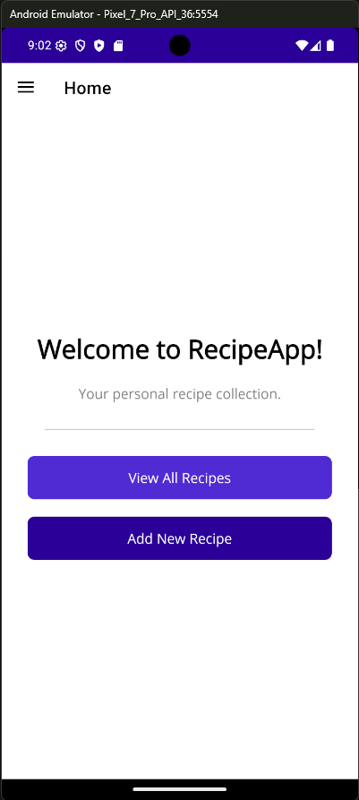
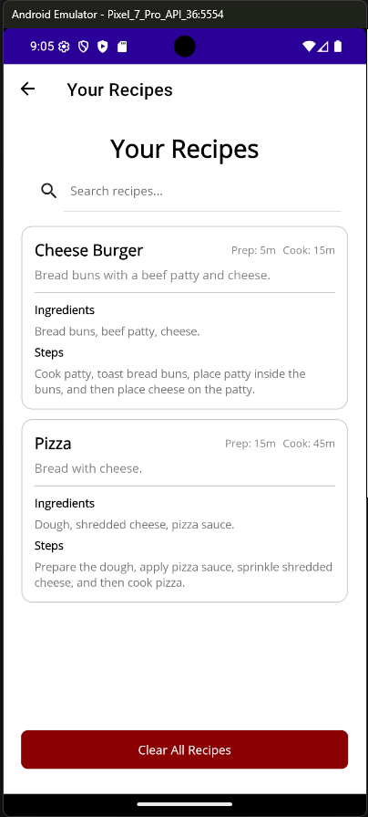
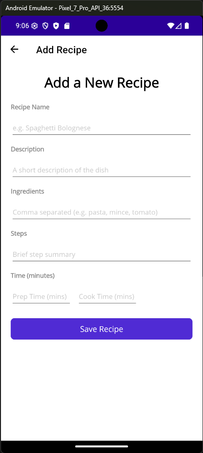
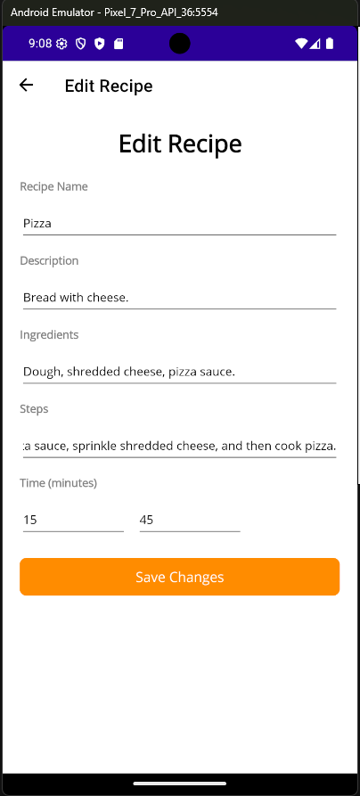

# RecipeApp .NET MAUI Mobile Application

A mobile app for creating, managing, and searching personal recipes with reliable local persistence.

Built to demonstrate .NET development practices:
- clean MVVM architecture with dependency injection
- testable shared logic in a separate Core library
- automated unit testing with xUnit

## Try the App (APK)

- Download the latest Android APK: https://github.com/Musy786/RecipeMobileApp/releases/tag/v1.0

## Features

- **View Recipes** - Browse saved recipes in a clear card-based layout
- **Create Recipes** - Add recipes with ingredients, steps, and prep/cook times
- **Edit Recipes** - Update existing recipes using tap or swipe actions
- **Delete Recipes** - Remove individual recipes or clear all recipes
- **Search Recipes** - Filter by name, description, or ingredients in real time
- **Input Validation** - Apply centralised validation with clear user-facing errors
- **Cross-Platform** - Run on Android, iOS, Windows, and MacCatalyst

## Quick Start (For Developers)

### Prerequisites
- .NET 9 SDK
- .NET MAUI workload installed
- Android emulator or physical Android device (recommended for testing)

### Installation and Running

```bash
# Clone the repository
git clone <repository-url>
cd RecipeMobileApp

# Restore and build
dotnet restore
dotnet build

# Run tests
dotnet test RecipeApp.Tests/RecipeApp.Tests.csproj
```

## Screenshots

### Home Screen


### Recipe List


### Add Recipe


### Edit Recipe


## Technology Stack

**Mobile App:**
- .NET MAUI 9
- XAML UI
- CommunityToolkit.Mvvm 8.3

**Data and Storage:**
- SQLite (`sqlite-net-pcl`)

**Testing:**
- xUnit
- Microsoft.NET.Test.Sdk

## Architecture

The solution follows a three-project structure:

```
RecipeMobileApp.sln:  
- RecipeApp.Core      # Shared business logic
- RecipeApp           # MAUI UI
- RecipeApp.Tests     # Unit tests (xUnit)
```

This separation keeps MAUI-specific code out of my testable logic and allows for clean project references.

## Key Validation Rules

- Recipe name is required (max 100 characters)
- Description is required (max 200 characters)
- Ingredients are required (max 500 characters)
- Steps are required (max 1000 characters)
- Prep time and cook time must be whole positive numbers (no decimals)

## Testing

Current automated coverage includes:
- Recipe model default values and property assignment
- Validator checks for required fields and max lengths
- Numeric validation for prep/cook times, including decimal rejection

Run tests with:

```bash
dotnet test RecipeApp.Tests/RecipeApp.Tests.csproj
```

## What I Learned

- How to structure a MAUI app using MVVM, DI, and clear page/viewmodel separation
- How to isolate business logic into a Core project so it can be tested independently of MAUI targets
- How to write focused xUnit tests for validation and model behaviour to improve reliability

## Future Improvements

- User accounts and cloud sync
- Recipe images and media attachments
- Categories/tags and advanced filtering
- Import/export recipes
- Meal planning and shopping list support